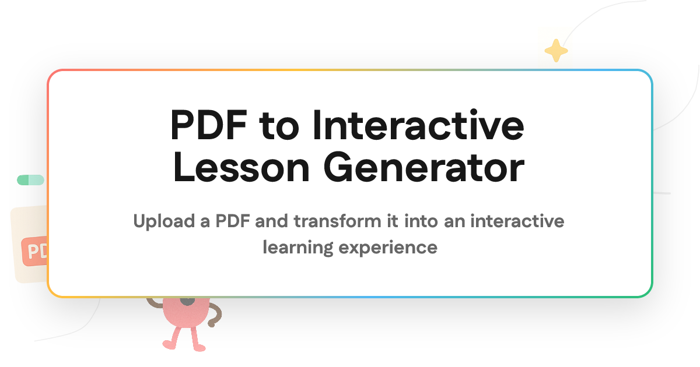

# [PDF to Lesson](https://pdf-to-interactive-lesson.vercel.app)

Upload a PDF and instantly generate a small interactive course with modules, lessons, quizzes, and flow-ordering questions. Powered by [Together AI](https://together.ai).

[](https://pdf-to-interactive-lesson.vercel.app)

## How it works

PDF to Interactive Lesson Generator extracts text from your uploaded PDF, sends the source content to Together AI-hosted models, and builds a structured 3-module course. Each module includes grounded lesson content plus interactive checks like short-answer, true-false, multiple-choice, and process-ordering questions.

1. **Upload** a PDF from the browser
2. **Extract** — the app reads the document text locally with MuPDF
3. **Generate** — Together AI models create the course structure, lessons, quizzes, and flow questions
4. **Repair** — duplicate or weak questions are detected and regenerated or hidden
5. **Learn & Share** — courses are saved so you can revisit progress or share a public course link

## Tech stack

- **Framework**: [Next.js](https://nextjs.org/) App Router
- **AI**: [Together AI](https://together.ai) — course planning, lesson generation, quiz generation, and flow-question generation (GPT OSS 120B)
- **PDF extraction**: [MuPDF](https://mupdf.com/)
- **Database**: [Neon Postgres](https://neon.tech) with [Drizzle ORM](https://orm.drizzle.team/)
- **Storage**: [Vercel Blob](https://vercel.com/docs/storage/vercel-blob)
- **Queueing and rate limiting**: [Upstash Redis](https://upstash.com)
- **Styling**: [Tailwind CSS](https://tailwindcss.com/)
- **UI**: [Radix UI](https://www.radix-ui.com/), [lucide-react](https://lucide.dev/), and custom interactive lesson components

## Under the hood

The generation pipeline is designed to be fast enough for a live demo while keeping the generated course grounded in the source PDF.

- **OCR and extraction**: MuPDF pulls text from the uploaded PDF before generation starts
- **Course planning**: one AI call creates the module structure
- **Flow assignment**: one AI call finds distinct source-backed processes for flow-ordering questions
- **Parallel lesson generation**: modules are generated concurrently to reduce wait time
- **Dedup repair**: similar questions are detected with Jaccard similarity, then regenerated or removed from the visible course
- **Persistence**: generated courses are stored in Postgres and PDF uploads are handled through Vercel Blob

For a deeper breakdown of the speed and quality work, see [`docs/course-generation-speedup.md`](docs/course-generation-speedup.md).

## Running Locally

### Cloning the repository

```bash
git clone https://github.com/Nutlope/pdf-to-interactive-lesson.git
cd pdf-to-interactive-lesson
```

### Getting API keys

**Together AI** (required — powers course generation):

1. Go to [Together AI](https://api.together.ai/settings/api-keys) to create an account
2. Copy your API key

**Neon** (required — stores generated courses):

1. Create a Postgres database with [Neon](https://neon.tech)
2. Copy your database connection string

**Vercel Blob** (required for the web app — stores uploaded PDFs):

1. Create or connect a [Vercel Blob](https://vercel.com/docs/storage/vercel-blob) store
2. Copy your read/write token

**Upstash Redis** (required for queueing and rate limiting):

1. Create an [Upstash Redis](https://upstash.com) database
2. Copy the REST URL and REST token

### Storing API keys in .env

Create a `.env.local` file in the root directory and add your keys:

```bash
TOGETHER_API_KEY=your_together_api_key_here
DATABASE_URL=your_neon_database_url_here
BLOB_READ_WRITE_TOKEN=your_vercel_blob_token_here
UPSTASH_REDIS_REST_URL=your_upstash_redis_rest_url_here
UPSTASH_REDIS_REST_TOKEN=your_upstash_redis_rest_token_here
NEXT_PUBLIC_APP_URL=http://localhost:3000
```

You can also enter a Together AI key directly in the app by clicking the key icon in the top-right corner.

### Installing dependencies

```bash
pnpm install
```

### Setting up the database

```bash
pnpm db:push
```

### Running the application

```bash
pnpm dev
```

The app will be available at `http://localhost:3000`.

## CLI

This repo also includes a small CLI for local generation, debugging, and benchmarking.

```bash
pnpm course generate data/document.pdf
pnpm course modules data/document.pdf
pnpm course benchmark data/document.md --runs 5
```

Useful flags:

- `--model <name>`
- `--output <path>`
- `--save-text-auto`
- `--no-validate`
- `--no-retry`
- `--max-retries <n>`
- `--verbose`
